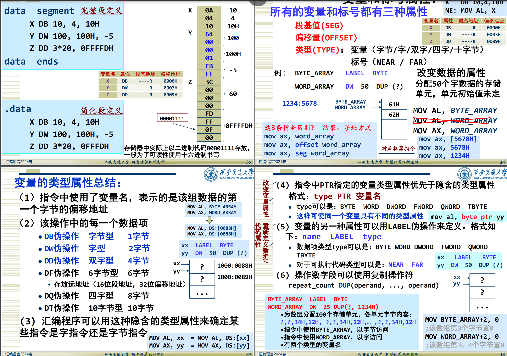

## 程序加载进内存时

ppt4-p77: 

> * pname.OBJ经连接后在当前目录下产生了pname.EXE和pname.MAP文件
>   * ......
>   * 内存映象文件（.MAP）: 给出每个段在存储器中的分配情况
>     * pname.MAP文件的内容为：
>     * ```assembly
>       Start  Stop   Length Name Class
>       00000H 00002H 00003H DATA
>       00010H 00020H 00011H CODE
>       Program entry point at 0001:0000
>       ```
>       * 00010H=0001 * 16 + 0000
>       * 从小段的开始地址分配段基地址
>
> * 程序装入时，动态分配实际的物理段基地址，设置段寄存器内容
>
>   * ```assembly
>     0004 B8 ---- R mov ax,dseg
>     0007 8E D8 mov ds,ax
>     ```
>
>   * 如P162: 程序段基址0001变成了08FE；根据MAP文件，数据段基址0000应该是08FE-0001=08FD


对于上面的描述是否理解为程序在LINK时便确定的段基地址只是相对的一个数字，且会默认从小段的起始地址`00000H（0000）`开始计算。而当实际加载到内存时，操作系统会为程序的每个段寄存器重新分配一个实际的段基地址：`004 B8 ---- R mov ax,dseg`


## 诸如数据段中的数字是否是以01比特串写入exe文件中？也就是说，这些东西都是由汇编器汇编后LINK链接写入.EXE文件中吗。


## 堆栈在内存中是自顶向下生长，栈顶位于低地址，而栈底位于高地址。在下图所示的堆栈段中，stack_seg是否是栈底地址（但表示这个段的最高地址）。也就是说不同于代码段段基地址或者数据段段基地址（段名），因为其表示的是所对应段的段首（是整个段的最低低地址）。换句话说，堆栈的栈顶指针SP如何寻址，是$SS\times 10H - SP$吗？


### solution

如图所示的内存空间表示上面是低地址下面是高地址，相当于开辟了50个字的存储空间，而top_of_stack则在图中是向上增长的。(也正是因为段基地址始终是低地址，因此要提前开辟一块区域，使得段基地址+50的top_of_stack可以-50次，也即增长五十字)。

## 过程定义伪指令

>过程名 PROC [类型]
>．．．
>过程名 ENDP
>
>汇编语言中无论是主程序还是子程序都可以以过程形式出现
>
>子程序涉及到RET返回方式，一定要用过程方式定义，并且明确属性

子程序是什么意思


## 数据定义伪指令

> 格式：[Variable] Mnemonic Operand, … , Operand [;Comments]
>
> * 汇编工具为变量(数据)分配存储单元，并设置初始值或者只预留空间
> *  Variable:变量名，可有可无，是变量的符号地址，如果指令使用了变量名，表示(指向)第一个字节的偏移地址

具体来讲什么时候表示偏移地址什么时候表示其值，不是说指令中使用了变量名，表示的是该组数据的第一个字节的偏移地址



## 同样是上一图，“标号”是指什么。以及“LABEL伪操作”和“type PTR 变量名”


TODO：

STACK段在内存中

段如何加载进内存（位置，排布，连续。。。）

exe中数据和加载进内存后的区别

